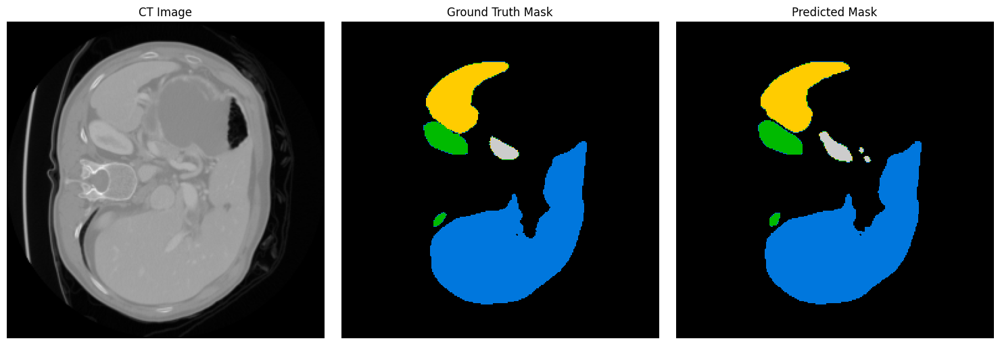
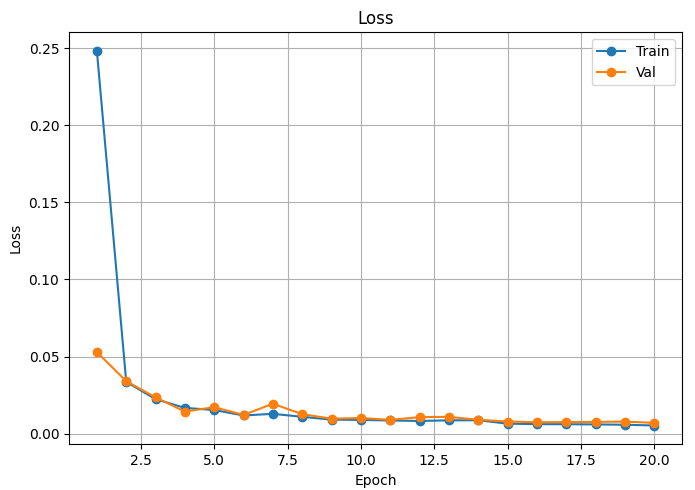
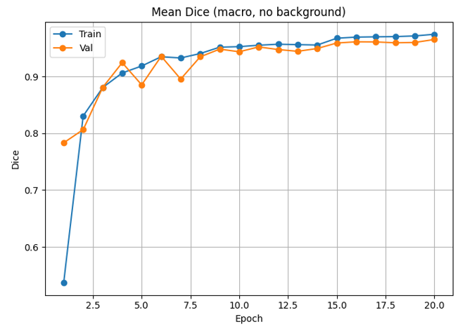
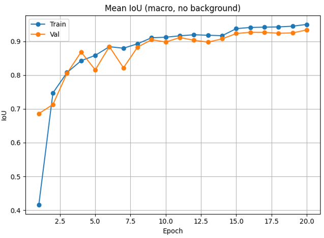
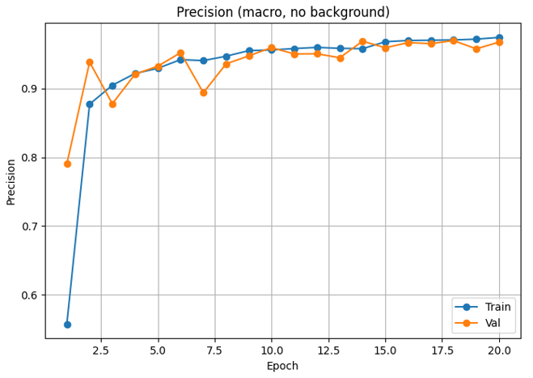
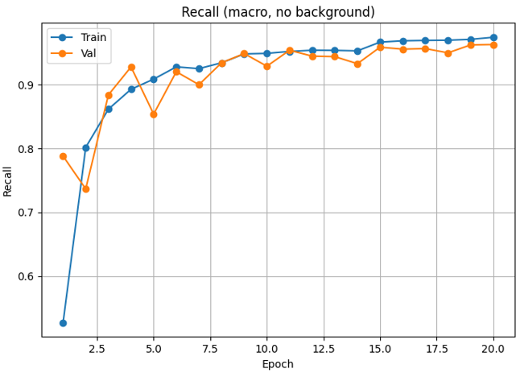
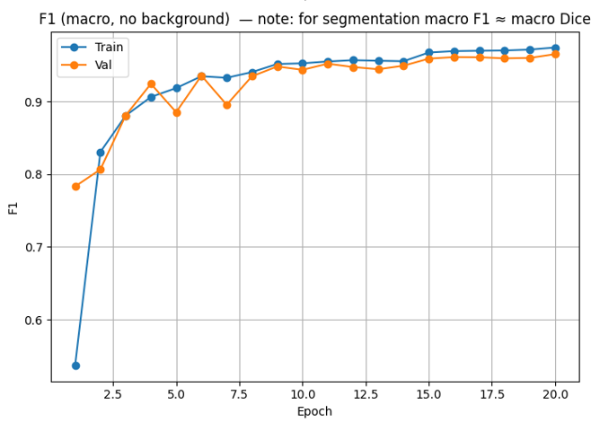
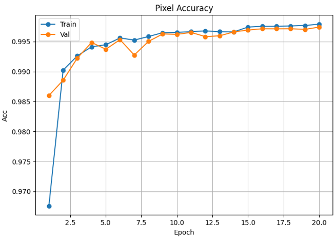
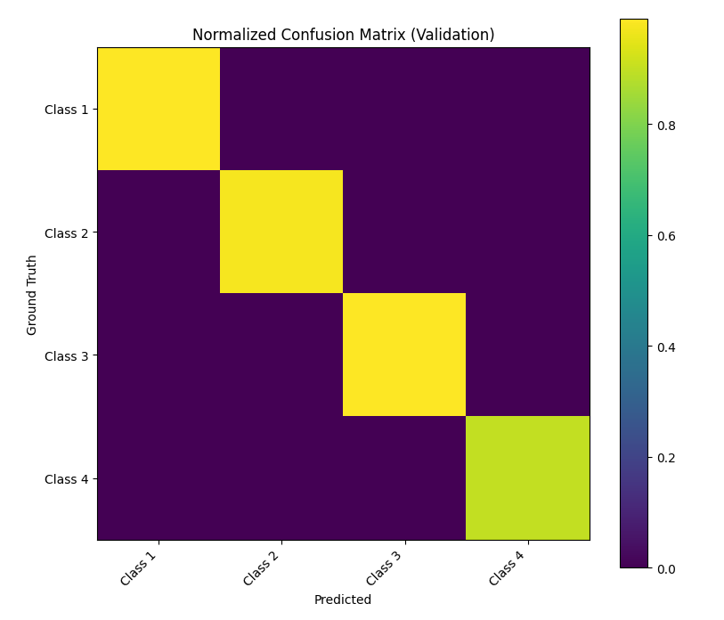

# U-Net Based Multi-Organ Segmentation of Abdominal CT (FLARE21)

This repository contains notebooks and materials for a U-Net based abdominal multi-organ segmentation project (originally developed on Kaggle).

NOTE:
- This repo intentionally does NOT include any dataset files (CT volumes / masks) or trained weights.
- The notebooks may still contain Kaggle-specific paths (e.g., /kaggle/input/...). I kept them unchanged as requested.

## Contents

- notebooks/
  - flare21-3d-to-2d-conversion.ipynb
  - flare21-3d-to-2d-conversion(slice).ipynb
- src/ (optional; for refactoring reusable code later)
- assets/ (optional; add qualitative result screenshots here)
- data/ (local only — should be ignored by git)
- models/ (local only — should be ignored by git)

## Project Summary

- Task: Multi-organ semantic segmentation on abdominal CT
- Approach: U-Net style encoder–decoder segmentation model
- Preprocessing: Includes a 3D -> 2D slice conversion workflow (see notebooks)

## Dataset

This project uses the FLARE21 dataset.

- Do NOT upload medical imaging datasets to GitHub.
- Download the dataset from the official source and keep it locally.

Suggested local structure (example):

    data/
      flare21/
        TrainingImg/
        TrainingMask/

## How to Use (Kaggle)

These notebooks were created for Kaggle. The most reliable way to run them without modification is:

1) Open the Kaggle notebook link (below)
2) Fork / Copy the notebook
3) Attach the dataset in Kaggle
4) Run all cells

## How to Use (Local)

You can run locally, but you may need to adjust file paths if the notebooks reference Kaggle directories.

1) Create environment

    python -m venv .venv

    Windows:
      .venv\Scripts\activate

    macOS/Linux:
      source .venv/bin/activate

2) Install dependencies

    pip install -r requirements.txt

3) Start Jupyter

    jupyter lab

Open the notebooks under notebooks/.

## Results

### Qualitative example (CT / Ground Truth / Prediction)

### Training curves and metrics

### Confusion Matrix (Validation)

## Links

Kaggle (main project):
https://www.kaggle.com/code/samirmahmud28/u-net-based-multi-organ-segmentation-of-abdominal

